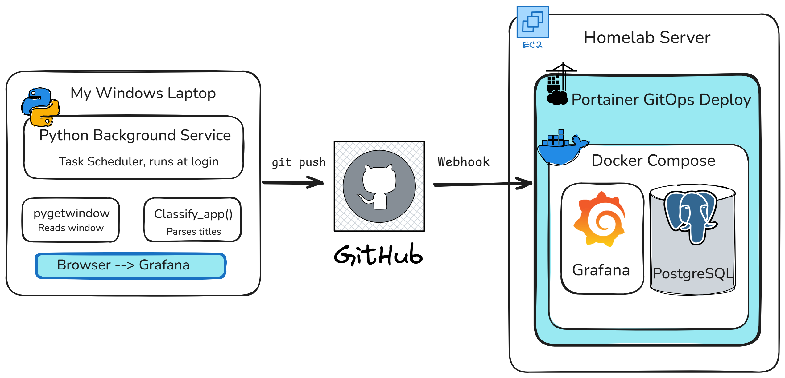

# Homelab Laptop Activity Tracker

This projects is one of the closest to my heart. After creating and testing it for a while, I felt real impact. Real Numbers. 

My problem was spending too much time on my laptop supposedly "studying" only to finish the day realizing I barely got anything done. I wanted to know exactly where my time was going, so I built a way to track it myself.

A Python background service that silently tracks active window and Chrome tab usage on a Windows laptop, stores sessions in PostgreSQL, and visualizes productivity patterns in Grafana, all running on AWS EC2 via Docker Compose with a GitOps deployment pipeline.

---

## Architecture

```
Windows Laptop
├── Python background service (Task Scheduler, runs at login)
│   ├── Reads active window title every 2 seconds via pygetwindow
│   ├── Parses app/site name via heuristic classification
│   └── Writes sessions to PostgreSQL on EC2 over TCP
│
└── Browser → Grafana dashboard on EC2 (port 3000)

AWS EC2 (t3.small, Ubuntu 24.04, eu-central-1)
├── Docker: postgres:16-alpine  — stores sessions + daily_stats
├── Docker: grafana:13.0.1      — dashboards provisioned via Git
└── Portainer                   — GitOps: git push → auto-redeploy
```

---

## Stack

| Layer | Technology |
|---|---|
| Tracking agent | Python 3.11, pygetwindow, psycopg2 |
| Database | PostgreSQL 16 |
| Visualization | Grafana 13 |
| Infrastructure | Docker Compose, AWS EC2, Portainer |
| CI/CD | GitHub Webhooks → Portainer GitOps |

---

## Dashboard Panels

- **Chrome Hours** — total browser time for the selected period (stat panel)
- **Time Per App** — top desktop apps ranked by usage (bar gauge)
- **Top Websites** — Chrome tab breakdown by site (bar gauge)
- **Categories Breakdown** — time bucketed into Deep Work, Learning, Career, Communication, Entertainment (donut chart)
- **Daily Screen Time** — hours per day over a 7-day window (bar chart)

---

## Database Schema

```sql
-- Raw sessions — every window switch creates a row
CREATE TABLE sessions (
    id            SERIAL PRIMARY KEY,
    app_name      TEXT        NOT NULL,
    window_title  TEXT,
    started_at    TIMESTAMPTZ NOT NULL,
    ended_at      TIMESTAMPTZ,
    duration_secs INTEGER GENERATED ALWAYS AS (
        EXTRACT(EPOCH FROM (ended_at - started_at))::INTEGER
    ) STORED
);

-- Pre-aggregated daily totals — updated on every session close
CREATE TABLE daily_stats (
    stat_date     DATE    NOT NULL,
    app_name      TEXT    NOT NULL,
    total_secs    INTEGER NOT NULL DEFAULT 0,
    session_count INTEGER NOT NULL DEFAULT 0,
    updated_at    TIMESTAMPTZ NOT NULL DEFAULT NOW(),
    PRIMARY KEY (stat_date, app_name)
);
```

`sessions` is the raw truth. `daily_stats` is pre-aggregated so Grafana queries stay fast without heavy GROUP BY on every refresh.

---

## Setup

### Prerequisites
- Python 3.11+
- Docker + Docker Compose
- An AWS EC2 instance (t3.small recommended, Ubuntu 24.04)
- Portainer installed on EC2

### 1. Clone the repo
```bash
git clone https://github.com/yourusername/Activity_Tracker_Homelab1
cd Activity_Tracker_Homelab1
```

### 2. Configure environment
```bash
cp .env.example .env
# Fill in your actual values
```

### 3. Deploy on EC2 via Portainer
- In Portainer: Stacks → Add Stack → Repository
- Point to this repo, set compose path to `docker-compose.yml`
- Add your `.env` variables in the Environment section
- Enable GitOps webhook — every `git push` triggers a redeploy

### 4. Run the Python tracker on Windows
- Open Task Scheduler → Create Task
- Trigger: At log on, run only when user is logged on
- Action: `C:\Program Files\Python311\python.exe`
- Arguments: `main.pyw`
- Start in: `<path to project folder>`

Install dependencies:
```bash
pip install psycopg2-binary pygetwindow python-dotenv psutil
```

---

## Environment Variables

```dotenv
DB_HOST=<your-ec2-public-ip>
DB_PORT=5432
DB_NAME=productivity_tracker
DB_USER=your_db_user
DB_PASSWORD=your_db_password
GRAFANA_ADMIN_USER=admin
GRAFANA_ADMIN_PASSWORD=your_grafana_password
POLL_INTERVAL=2
LOG_LEVEL=INFO
```

---

## Challenges & Troubleshooting

### 1. Network resilience — laptop sleep / Wi-Fi switching
The tracker runs on a laptop that sleeps and changes networks. This silently killed the persistent PostgreSQL connection and crashed the script.

**Solution:** Added a `SELECT 1` ping before every poll. If it fails, an auto-reconnect loop catches the exception and re-establishes the connection without crashing.

---

### 2. Ghost scripts — multiple silent instances corrupting the DB
During testing, multiple invisible Python instances spawned simultaneously. They raced to update the same rows, producing corrupted `ended_at` timestamps and duplicate entries.

**Solution:** Lock file at startup. The script writes its PID to `tracker.lock` and checks on startup whether that PID is still alive using `psutil.pid_exists()`. If alive, it exits. If stale (from a crash), it overwrites. `os.kill(pid, 0)` was not used because it does not work correctly on Windows.

---

### 3. Chrome Tracking & Title Parsing with Tampermonkey
Problem: Initial strategy relied on reading title from chrome tab. Some websites didn't include the domain name in the tab title (like chatgpt & AWS), and using Chrome DevTools (CDP) for tracking is invasive, and relying on OS window titles is messy. 

**Solution:** Tampermonkey, a browser extension that lets you run custom JavaScript on the fly, to permanently inject the hostname into the tab title so the tracker can catch it.

```javascript
(function() {
    'use strict';
    // Get the core domain (e.g., "chatgpt.com" or "18.198.111.119")
    const domain = window.location.hostname;
    const prefix = `[${domain}] `;
    // Function to force the prefix
    const enforcePrefix = () => {
        if (!document.title.startsWith(prefix)) {
            // Clean up if a site dynamically changed its title and pushed our prefix away
            let cleanTitle = document.title.replace(new RegExp(`^\\[${domain}\\] `), '');
            document.title = prefix + cleanTitle;
        }
    };
    // Run immediately, then check every 2 seconds in case React/Angular changes the title
    enforcePrefix();
    setInterval(enforcePrefix, 2000);
})();
```

---

### 4. Docker bind mount path resolution in Portainer
Grafana dashboards were not loading after deploying via Portainer. `ls -R /etc/grafana/provisioning` inside the container showed the expected directory structure was missing entirely.

**Root cause:** The relative path `./grafana/provisioning` in `docker-compose.yml` is resolved relative to wherever `docker compose` is invoked. Portainer executes stacks from its own internal working directory (`/data/compose/1`), not the repo root, so Docker mounted an empty directory.

**Solution:** Replace the relative path with an absolute path:
```yaml
- /home/ubuntu/homelab/Activity_Tracker_Homelab1/grafana/provisioning:/etc/grafana/provisioning
```

---

### 5. Windows Service isolation — Session 0
NSSM was used initially to register the tracker as a Windows Service. The service started and immediately stopped with no error output. The root cause is Windows Session 0 isolation: all services run in a headless environment with no desktop access, and `pygetwindow` uses Win32 APIs that require an active GUI session.

**Solution:** Migrated to Task Scheduler with "Run only when user is logged on." This runs the script in the active user session (Session 1+) where `pygetwindow` can see the desktop normally.

---

### 6. Grafana auto-provisioning broken in 13.0.x
After upgrading to Grafana 12.2.0+, the PostgreSQL datasource stopped connecting automatically on container startup. The error was `"You do not currently have a default database configured"` despite the YAML appearing correct. Clicking Save & Test manually in the UI worked fine.

**Root cause:** A breaking schema change in Grafana 12.2.0 silently dropped the `database` field at the root level of the provisioning YAML.

**Solution:** Move `database` into the `jsonData` block:
```yaml
jsonData:
  database: ${GF_DATABASE_NAME}  # must be here in Grafana 12.2.0+
```

---

### 7. Provisioned dashboards are read-only in Grafana
After enabling GitOps provisioning, the Grafana UI blocked saving any dashboard changes with a message saying the dashboard is managed by an external source.

This is expected behavior. In provisioning mode, the JSON file in the repo is the source of truth. All edits must be made to the JSON file, committed, and pushed — Portainer picks up the change and Grafana reloads automatically.

---

## Project Structure

```
Activity_Tracker_Homelab1/
├── main.pyw                        # Python tracking agent
├── docker-compose.yml              # Postgres + Grafana services
├── .env.example                    # Environment variable template
├── .gitignore
└── grafana/
    └── provisioning/
        ├── datasources/
        │   └── postgres.yaml       # Auto-configures DB connection
        └── dashboards/
            ├── dashboards.yaml     # Points Grafana at the JSON files
            └── productivity.json   # Exported dashboard panels
```